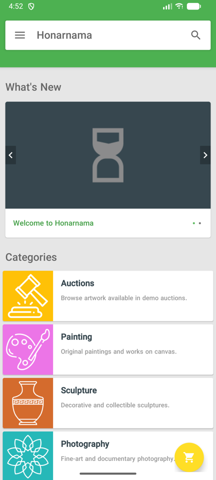
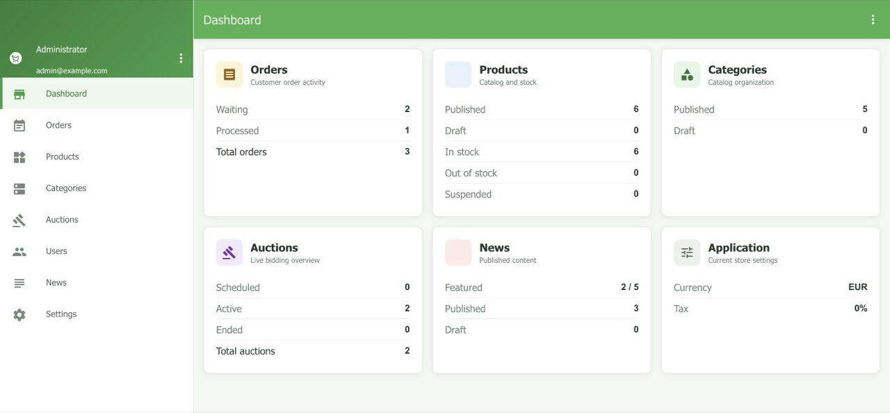

# Honarnama

[](https://github.com/hashemi1997ali/honarnama/actions/workflows/ci.yml)

Honarnama is a university artwork marketplace with a native Android application, an AngularJS administration panel, a PHP REST API, and a PostgreSQL database. The project was originally presented in January 2021 and has since been modernized for portfolio and educational use.

<p align="center">
  
  &nbsp;&nbsp;
  
</p>

<p align="center">
  
</p>

## Highlights

- Browse, search, wishlist, cart, checkout, order history, and demo auctions
- Product discounts, live stock validation, and atomic inventory updates
- Admin management for orders, products, categories, auctions, users, news, and settings
- PHP/PDO backend with parameterized PostgreSQL queries
- Repeatable Neon/PostgreSQL migration and sample-data seed
- GitHub Actions checks for PHP, database migration, Android lint, and APK builds

## Stack

| Component | Technology |
| --- | --- |
| Android | Java 17, AndroidX, Material Components, Retrofit, Glide |
| Admin panel | AngularJS 1.8.3, AngularJS Material |
| Backend | PHP 8.2+, PDO PostgreSQL |
| Database | Neon/PostgreSQL |

## Run Locally

### Backend and admin panel

Requirements: PHP 8.2+ with `pdo_pgsql` and a PostgreSQL or Neon database.

```bash
cp .env.example .env
php panel/database/migrate.php
php panel/database/seed.php
php -S 127.0.0.1:8000 dev-router.php
```

Complete `.env` before running the migration. Use the pooled Neon URL for normal traffic and the direct URL for migrations. The admin panel is available at `http://127.0.0.1:8000/panel/`.

### Android app

Open `Market/` in Android Studio and add the following values to `Market/local.properties`:

```properties
BACKEND_URL=http://10.0.2.2:8000/panel/
SECURITY_CODE=the-same-value-used-in-.env
CONTACT_EMAIL=contact@example.com
```

Start the PHP server, select an emulator, and run the `app` configuration. `10.0.2.2` lets the Android Emulator reach the host machine.

## Build and CI

```bash
find panel -type f -name '*.php' -print0 | xargs -0 -n1 php -l
cd Market && ./gradlew lintDebug assembleDebug
```

Every successful [CI run](https://github.com/hashemi1997ali/honarnama/actions/workflows/ci.yml) provides a `honarnama-debug-apk` artifact for 14 days. Generated APK files are intentionally excluded from Git history.

## Project History

Honarnama was created by [Ali Hashemi](https://github.com/hashemi1997ali) and his friend [Ali Ferasatpour](https://www.linkedin.com/in/ali-ferasatpour-a15b08108/).

Ali Ferasatpour has passed away. This repository is preserved in gratitude for his friendship, contribution, and the work created together. May his memory always be honored.

## Security and Usage

Never commit `.env`, database credentials, runtime uploads, customer data, or signing keys. Review authentication, upload handling, and HTTPS configuration before production use. See [SECURITY.md](SECURITY.md) for details.

No project-wide license has been granted. The repository is available for portfolio and educational review only.
